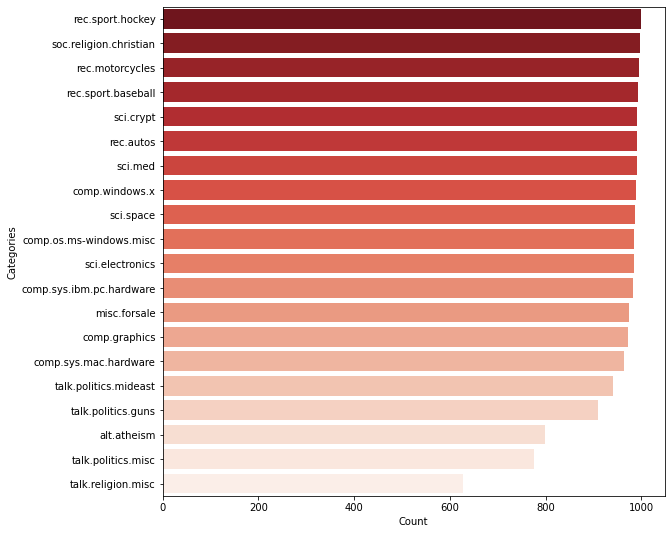
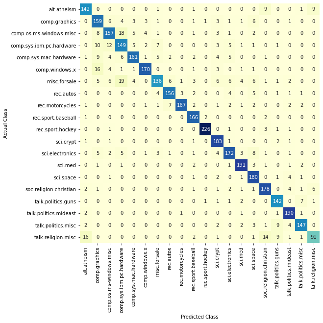

# News-Category-Classification-using-TF-IDF-Vectorizer-and-Multinomial-Naive-Bayes
News Category Classification using TF-IDF Vectorizer and Multinomial Naive Bayes with Hyperparameter Tuning

## About the Project

This project focuses on classifying news articles into different categories using a combination of **TF-IDF Vectorizer** as Word Embedding (to convert text data into vectors) and the **Multinomial Naive Bayes** algorithm to perform text classification. The dataset utilized is the **20newsgroups dataset**, consisting of **18,846 samples** of news data distributed across **20 classes**. The headers and footers of each news article are included to reduce overfitting.

## Technology Used
* Python
* Pandas
* Numpy
* Matplotlib
* Seaborn
* Scikit-learn

## Notebook File
* [notebooks/news_category_classification.ipynb](notebooks/news_category_classification.ipynb)

## Workflow

### Data Collection
  - This project utilizes the `20newsgroups dataset`, which consists of a total of **18,846 samples of news data**, categorized into **20 classes**.
  - The 20newsgroups dataset is obtained from the **Scikit Learn Dataset**: [sklearn.datasets.fetch_20newsgroups](https://scikit-learn.org/stable/modules/generated/sklearn.datasets.fetch_20newsgroups.html).
  - The **headers** and **footers** of each news data are included in this project to **reduce overfitting**.
  - The 20 classes present in the dataset are as follows:
    
    1. rec.sport.hockey
    2. soc.religion.christian
    3. rec.motorcycles
    4. rec.sport.baseball
    5. sci.crypt
    6. rec.autos
    7. sci.med
    8. comp.windows.x
    9. sci.space
    10. comp.os.ms-windows.misc
    11. sci.electronics
    12. comp.sys.ibm.pc.hardware
    13. misc.forsale
    14. comp.graphics
    15. comp.sys.mac.hardware
    16. talk.politics.mideast
    17. talk.politics.guns
    18. alt.atheism
    19. talk.politics.misc
    20. talk.religion.misc

  - **Here is the data distribution for each class:**

    

### Data Preprocessing
  - The data preprocessing steps applied to the data include:
    - **Case folding**: Transform all letters into lowercase.
    - **Stopword removal** using **TF-IDF Vectorizer** provided by Scikit Learn library
    - Train the **TF-IDF Vectorizer** model using **TF-IDF Vectorizer** provided by Scikit Learn library
  - The trained **TF-IDF Vectorizer** model is saved in [models/news_vectorizer.sav](models/news_vectorizer.sav)

### Data Splitting
  - The data is split into **training data** and **testing data** with a ratio of 0.2, signifying **80% for training data** and **20% for testing data**. The random_state variable is set to 0.

### Model Building & Training
  - The model is trained using the **Multinomial Naive Bayes** algorithm.
  - To obtain the best parameters, the training process is conducted using the **Hyperparameter Tuning** technique with the **Grid Search** method, which involves trying all possible combinations from a list of hyperparameters.
  - Here is the list of **hyperparameters** used in the training process:
    - **'alpha'** (Additive (Laplace/Lidstone) smoothing parameter) :
      - 0,
      - 1.0,
      - 2.0,
      - 3.0
    - **'fit_prior'** (Whether to learn class prior probabilities or not) :
      - True,
      - False
  - After the training process is complete, the best parameters obtained are as follows:
    - **'alpha'**: 0
    - **'fit_prior'**: True
  - Then, the training process is conducted once again using the best parameters obtained from the **hyperparameter tuning** process to acquire the final model that will be used in the subsequent stages.
  - The final model is saved to [models/MNB_Model.sav](models/MNB_Model.sav)

### Model Evaluation
  - Confusion Matrix:

    
  
  - **Accuracy Score:**
    - 0.8655172413793103 (**86.55%**)
  - **Precision:**
    - 0.8655172413793103 (**86.55%**)
  - **Recall:**
    - 0.8655172413793103 (**86.55%**)
  - **F1 Score:**
    - 0.8655172413793104 (**86.55%**)

## Contributors
* [Linggar Maretva Cendani](https://github.com/LinggarM) - [linggarmc@gmail.com](mailto:linggarmc@gmail.com)

## License
This project is licensed under the MIT License - see the [LICENSE](LICENSE) file for details
